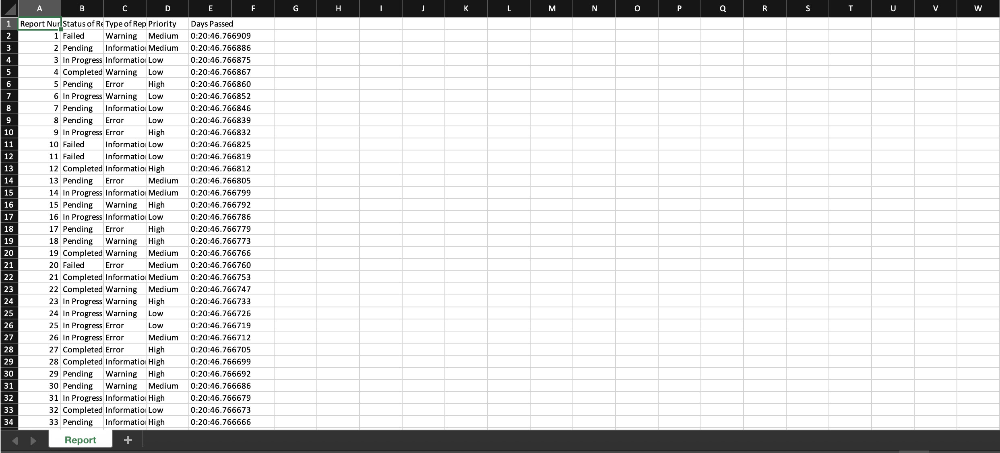

# django-excel-extract


<!-- [](https://coveralls.io/github/farridav/django-jazzmin?branch=main) -->

`django-excel-extract` helps you easily export Django model data into an Excel file (.xlsx) with minimal setup.

## Installation

```bash
pip install django-excel-extract
```

### ORM

**Avaliable ORM methods**:

- `.all()`
- `.get()`
- `.filter()`
- `.values()`
- `.annotate()`

---

# Example

### Follow the link to view main page: http://127.0.0.1:8000/app/index/


`Extract Report Get` button contains:

```python
def extract_excel_get(request):
    queryset = Report.objects.get(id=1)

    exclude = ['id']

    excel = Excel(
        model=Report,
        queryset=queryset,
        file_name='report_get',
        title='Report',
        exclude=exclude,
        date_time_format='%d/%m/%Y',
    )

    return excel.to_excel()
```

Result:


---

`Extract Report Filter` button contains:

```python
def extract_excel_filter(request):
    queryset = Report.objects.filter(priority=Priority.HIGH)

    exclude = ['id']

    excel = Excel(
        model=Report,
        queryset=queryset,
        file_name='report_filter',
        title='Report',
        exclude=exclude,
        date_time_format='%d/%m/%Y',
    )

    return excel.to_excel()

```

Result:


---

`Extract Report Values` button contains:

```python
def extract_excel_values(request):
    queryset = Report.objects.annotate(
        days_passed=ExpressionWrapper(
            now() - F('created_at'),
            output_field=fields.DurationField(),
        )
    ).values(
        'id',
        'report_num',
        'status_report',
        'type_report',
        'priority',
        'days_passed',
    )

    aggregation_field_names = {'days_passed': 'Days Passed'}

    exclude = ['id']

    excel = Excel(
        model=Report,
        queryset=queryset,
        file_name='report_values',
        title='Report',
        exclude=exclude,
        date_time_format='%d/%m/%Y',
        annotation_fields_map=aggregation_field_names,
    )

    return excel.to_excel()
```

Result:



---

### Features

- Export any Django model `QuerySet` to Excel.
- Flexible customize fields output `(dates, datetimes, booleans, choices, annotated fields)`.
- Exclude specific fields.
- Supports `ManyToMany` and `ForeignKey` fields.
- Supports main objects query (`.all()`, `.get()`, `.values()`, `.annotate()`)
- Simple integration into Django views.

---

#### Open source is love, and coffee is fuel. If my code helped you out, send a coffee my way ☕😉😎

https://buymeacoffee.com/dmitrytok

